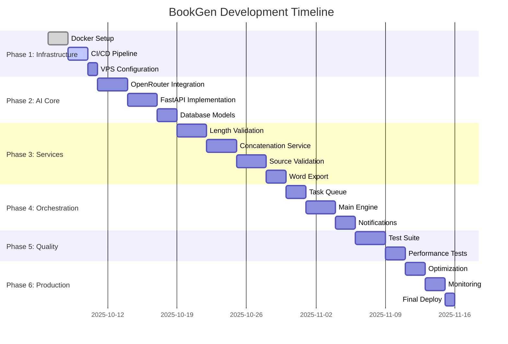

# Plan de Trabajo - Sistema BookGen Automatizado

## 📋 Información del Proyecto

**Proyecto:** Sistema de Generación Automática de Biografías  
**Repositorio:** JPMarichal/bookgen  
**Fecha de Inicio:** 6 de octubre de 2025  
**Metodología:** Desarrollo Ágil con CI/CD  
**Plataforma:** Windows 11 (Dev) → Ubuntu VPS (Prod)  

---

## 🎯 Objetivos Generales

1. **Automatización Completa:** Eliminar intervención manual en la generación de biografías
2. **Integración de Servicios:** Unificar utilidades dispersas (`check_lengths.py`, `concat.py`) 
3. **Producción Robusta:** Sistema containerizado con CI/CD en VPS Ubuntu IONOS
4. **Calidad Garantizada:** Validación automática de fuentes y contenido con IA

---

## 📊 Fases del Proyecto

### 🏗️ **FASE 1: Infraestructura y Configuración Base**
**Duración Estimada:** 3-5 días  
**Objetivo:** Establecer la base técnica del sistema

#### **Entregables:**
- ✅ Sistema de contenedores Docker funcional
- ✅ Pipeline CI/CD con GitHub Actions
- ✅ Configuración de entorno de desarrollo y producción
- ✅ Estructura de logging y monitoreo

#### **Tareas (GitHub Issues):**

##### **Issue #1: Configuración de Contenedores Docker** 
```yaml
Título: "Setup Docker containers for development and production"
Labels: [infrastructure, docker, setup]
Milestone: Phase 1 - Infrastructure
Assignee: AI Assistant

Descripción:
- Crear Dockerfile optimizado con multi-stage build
- Configurar docker-compose.yml para desarrollo local
- Configurar docker-compose.prod.yml para VPS Ubuntu
- Implementar health checks y resource limits

Criterios de Aceptación:
- [ ] Dockerfile construye imagen < 500MB
- [ ] Contenedor inicia en < 30 segundos
- [ ] Health check responde en /health endpoint
- [ ] Variables de entorno cargadas correctamente
- [ ] Volúmenes persistentes configurados

Comandos de Verificación:
```bash
docker build -t bookgen:test .
docker run --rm bookgen:test python -c "import src.main; print('OK')"
docker-compose up -d
curl -f http://localhost:8000/health
```

##### **Issue #2: Pipeline CI/CD con GitHub Actions**
```yaml
Título: "Implement CI/CD pipeline with automated deployment"
Labels: [cicd, github-actions, automation]
Milestone: Phase 1 - Infrastructure
Dependencies: Issue #1

Descripción:
- Crear workflow de testing automático
- Configurar build y push a GitHub Container Registry
- Implementar deployment automático a VPS Ubuntu
- Configurar secrets y variables de entorno

Criterios de Aceptación:
- [ ] Tests ejecutan automáticamente en PR
- [ ] Build se ejecuta solo con tests pasados
- [ ] Deploy automático en push a main
- [ ] Rollback automático si deploy falla
- [ ] Notificaciones de estado implementadas

Comandos de Verificación:
```bash
git push origin main
# Verificar en GitHub Actions tab
curl -f https://bookgen.yourdomain.com/health
```

##### **Issue #3: Configuración de VPS Ubuntu IONOS**
```yaml
Título: "Configure Ubuntu VPS production environment"
Labels: [infrastructure, vps, production]
Milestone: Phase 1 - Infrastructure

Descripción:
- Ejecutar script de deployment en VPS
- Configurar Nginx reverse proxy con SSL
- Implementar monitoreo y logging
- Configurar backups automáticos

Criterios de Aceptación:
- [ ] VPS accesible via SSH con clave
- [ ] Docker y docker-compose instalados
- [ ] Certificado SSL configurado y válido
- [ ] Nginx proxy funcional con rate limiting
- [ ] Backups diarios programados
- [ ] Monitoreo cada 5 minutos activo

Comandos de Verificación:
```bash
ssh user@vps-ip "docker ps"
curl -I https://bookgen.yourdomain.com
systemctl status bookgen
ls -la /opt/bookgen/backups/
```

---

### 🧠 **FASE 2: Core de IA y Servicios Base**
**Duración Estimada:** 7-10 días  
**Objetivo:** Implementar el motor de IA y servicios fundamentales

#### **Entregables:**
- Sistema de integración con OpenRouter/Qwen2.5 VL 72B
- API REST completa con FastAPI
- Base de datos y modelos de datos
- Sistema de colas para procesamiento asíncrono

#### **Tareas (GitHub Issues):**

##### **Issue #4: Integración con OpenRouter API**
```yaml
Título: "Implement OpenRouter API integration for AI content generation"
Labels: [ai, api-integration, core]
Milestone: Phase 2 - AI Core

Descripción:
- Crear cliente para OpenRouter API
- Implementar manejo de rate limits y errores
- Configurar modelo Qwen2.5 VL 72B
- Crear sistema de retry y fallback

Criterios de Aceptación:
- [ ] Cliente API con manejo de errores robusto
- [ ] Rate limiting respetado (free tier)
- [ ] Timeouts configurables (300s por defecto)
- [ ] Logging detallado de requests/responses
- [ ] Sistema de retry exponential backoff
- [ ] Métricas de uso y costos

Comandos de Verificación:
```python
from src.services.openrouter_client import OpenRouterClient
client = OpenRouterClient()
response = client.generate_text("Test prompt")
assert len(response) > 0
```

##### **Issue #5: API REST con FastAPI**
```yaml
Título: "Create RESTful API using FastAPI framework"
Labels: [api, fastapi, backend]
Milestone: Phase 2 - AI Core
Dependencies: Issue #4

Descripción:
- Estructura base de FastAPI con routers
- Endpoints para generación de biografías
- Sistema de autenticación y autorización
- Documentación automática con Swagger

Endpoints Requeridos:
- POST /api/v1/biographies/generate
- GET /api/v1/biographies/{id}/status
- GET /api/v1/biographies/{id}/download
- POST /api/v1/sources/validate
- GET /health

Criterios de Aceptación:
- [ ] API responde en puerto 8000
- [ ] Documentación Swagger en /docs
- [ ] Validación de entrada con Pydantic
- [ ] Manejo de errores HTTP estándar
- [ ] CORS configurado correctamente
- [ ] Rate limiting por IP implementado

Comandos de Verificación:
```bash
curl -X POST "http://localhost:8000/api/v1/biographies/generate" \
  -H "Content-Type: application/json" \
  -d '{"character": "test", "chapters": 5}'
curl http://localhost:8000/docs
```

##### **Issue #6: Modelos de Datos y Base de Datos**
```yaml
Título: "Design and implement data models with SQLAlchemy"
Labels: [database, models, sqlalchemy]
Milestone: Phase 2 - AI Core

Descripción:
- Modelos SQLAlchemy para biografías, capítulos, fuentes
- Sistema de migraciones con Alembic
- Repositorios y patrones de acceso a datos
- Configuración SQLite para desarrollo y producción

Modelos Principales:
- Biography (id, character_name, status, created_at, metadata)
- Chapter (id, biography_id, number, title, content, word_count)
- Source (id, url, title, relevance_score, validation_status)
- GenerationJob (id, biography_id, status, progress, logs)

Criterios de Aceptación:
- [ ] Modelos con relaciones correctas definidas
- [ ] Migraciones automáticas funcionando
- [ ] Índices optimizados para queries frecuentes
- [ ] Validaciones a nivel de modelo
- [ ] Repositorios con métodos CRUD
- [ ] Conexión pool configurada

Comandos de Verificación:
```python
from src.models import Biography, Chapter
biography = Biography(character_name="test")
assert biography.id is not None
chapter = Chapter(biography=biography, number=1)
assert len(biography.chapters) == 1
```

---

### 🔧 **FASE 3: Servicios de Procesamiento**
**Duración Estimada:** 8-12 días  
**Objetivo:** Implementar la lógica de negocio y procesamiento de contenido

#### **Entregables:**
- Servicio de validación de longitudes
- Servicio de concatenación inteligente
- Servicio de validación de fuentes avanzada
- Sistema de exportación a Word con TOC

#### **Tareas (GitHub Issues):**

##### **Issue #7: Servicio de Validación de Longitudes**
```yaml
Título: "Implement intelligent chapter length validation service"
Labels: [service, validation, nlp]
Milestone: Phase 3 - Processing Services
Dependencies: Issue #6

Descripción:
- Migrar lógica de check_lengths.py
- Implementar validación con análisis semántico
- Configurar umbrales inteligentes por tipo de contenido
- Sistema de sugerencias de mejora

Criterios de Aceptación:
- [ ] Validación de longitud 3000-15000 palabras/capítulo
- [ ] Análisis de densidad de información
- [ ] Detección de contenido repetitivo
- [ ] Sugerencias de expansión/reducción
- [ ] Scoring de calidad 0-100
- [ ] Integración con pipeline de generación

Comandos de Verificación:
```python
from src.services.length_validator import LengthValidationService
validator = LengthValidationService()
result = validator.validate_chapter(chapter_text, target_length=5000)
assert result.is_valid is True
assert 0 <= result.quality_score <= 100
```

##### **Issue #8: Servicio de Concatenación Inteligente**
```yaml
Título: "Develop smart content concatenation service"
Labels: [service, content, nlp]
Milestone: Phase 3 - Processing Services
Dependencies: Issue #7

Descripción:
- Migrar y mejorar lógica de concat.py
- Implementar transiciones inteligentes entre capítulos
- Sistema de coherencia narrativa
- Optimización de flujo de lectura

Criterios de Aceptación:
- [ ] Concatenación preserva coherencia narrativa
- [ ] Transiciones naturales entre capítulos
- [ ] Eliminación automática de redundancias
- [ ] Mantenimiento de cronología correcta
- [ ] Validación de referencias cruzadas
- [ ] Generación de índice automático

Comandos de Verificación:
```python
from src.services.concatenation import ConcatenationService
service = ConcatenationService()
result = service.concatenate_chapters(chapters_list)
assert result.coherence_score > 0.8
assert len(result.transition_errors) == 0
```

##### **Issue #9: Validación Avanzada de Fuentes**
```yaml
Título: "Implement advanced source validation with AI analysis"
Labels: [service, validation, ai, sources]
Milestone: Phase 3 - Processing Services
Dependencies: Issue #4

Descripción:
- Sistema de validación de relevancia con TF-IDF
- Verificación de credibilidad de fuentes
- Análisis de actualidad y precisión
- Scoring automático de confiabilidad

Criterios de Aceptación:
- [ ] Análisis de similitud semántica > 0.7
- [ ] Verificación de dominios confiables
- [ ] Detección de fechas y actualidad
- [ ] Scoring de credibilidad 0-100
- [ ] Filtrado automático de fuentes irrelevantes
- [ ] Sugerencias de fuentes adicionales

Comandos de Verificación:
```python
from src.services.source_validator import SourceValidationService
validator = SourceValidationService()
result = validator.validate_sources(biography_topic, sources_list)
assert result.average_relevance > 0.7
assert len(result.rejected_sources) >= 0
```

##### **Issue #10: Exportador a Word con TOC**
```yaml
Título: "Create Word document exporter with automatic TOC"
Labels: [export, word, document]
Milestone: Phase 3 - Processing Services
Dependencies: Issue #8

Descripción:
- Integración con Pandoc para generación Word
- Tabla de contenidos automática
- Formato profesional con estilos
- Metadata y propiedades del documento

Criterios de Aceptación:
- [ ] Documentos .docx con TOC funcional
- [ ] Estilos profesionales aplicados
- [ ] Numeración automática de páginas
- [ ] Metadata completa (autor, título, fecha)
- [ ] Hipervínculos internos funcionando
- [ ] Compatibilidad con Microsoft Word

Comandos de Verificación:
```python
from src.services.word_exporter import WordExporter
exporter = WordExporter()
doc_path = exporter.export_biography(biography)
assert os.path.exists(doc_path)
assert doc_path.endswith('.docx')
```

---

### 🎭 **FASE 4: Orquestación y Flujo de Trabajo**
**Duración Estimada:** 5-7 días  
**Objetivo:** Integrar todos los servicios en un flujo cohesivo

#### **Entregables:**
- Sistema de colas con Celery/Redis
- Orquestador principal de flujo de trabajo
- Sistema de notificaciones y estados
- Workers especializados por tarea

#### **Tareas (GitHub Issues):**

##### **Issue #11: Sistema de Colas Asíncrono**
```yaml
Título: "Implement asynchronous task queue with Redis/Celery"
Labels: [queue, async, celery, redis]
Milestone: Phase 4 - Orchestration

Descripción:
- Configuración de Redis como broker
- Workers Celery especializados
- Sistema de prioridades de tareas
- Monitoreo de cola y workers

Criterios de Aceptación:
- [ ] Redis funcionando como message broker
- [ ] Workers Celery especializados funcionando
- [ ] Sistema de prioridades implementado
- [ ] Monitoring de tareas en tiempo real
- [ ] Retry automático con exponential backoff
- [ ] Dead letter queue para tareas fallidas

Comandos de Verificación:
```bash
celery -A src.worker worker --loglevel=info
redis-cli ping
celery -A src.worker inspect active
```

##### **Issue #12: Orquestador Principal (BookGen Engine)**
```yaml
Título: "Create main orchestration engine for biography generation"
Labels: [orchestration, engine, workflow]
Milestone: Phase 4 - Orchestration
Dependencies: Issue #11

Descripción:
- Motor principal que coordina todos los servicios
- Estado de máquina para seguimiento de progreso
- Manejo de errores y recuperación
- Interfaz unificada para generación completa

Estados del Workflow:
1. INITIALIZED
2. SOURCES_VALIDATING
3. CONTENT_GENERATING
4. CHAPTERS_VALIDATING
5. CONCATENATING
6. EXPORTING
7. COMPLETED
8. FAILED

Criterios de Aceptación:
- [ ] Máquina de estados bien definida
- [ ] Persistencia de estado en base de datos
- [ ] Recuperación automática de fallos
- [ ] Progreso reportado en tiempo real
- [ ] Rollback automático en errores críticos
- [ ] Logs detallados de cada paso

Comandos de Verificación:
```python
from src.engine.bookgen_engine import BookGenEngine
engine = BookGenEngine()
job_id = engine.generate_biography("winston_churchill")
status = engine.get_status(job_id)
assert status.state in ["GENERATING", "COMPLETED"]
```

##### **Issue #13: Sistema de Notificaciones**
```yaml
Título: "Implement comprehensive notification system"
Labels: [notifications, webhooks, email]
Milestone: Phase 4 - Orchestration

Descripción:
- Webhooks para integración con sistemas externos
- Notificaciones por email opcionales
- WebSocket para updates en tiempo real
- Sistema de alertas de errores

Criterios de Aceptación:
- [ ] WebSockets para updates tiempo real
- [ ] Webhooks configurables por usuario
- [ ] Email notifications opcionales
- [ ] Alertas automáticas para admin
- [ ] Logs de notificaciones enviadas
- [ ] Rate limiting para evitar spam

Comandos de Verificación:
```python
from src.services.notifications import NotificationService
service = NotificationService()
service.send_completion_notification(job_id, webhook_url)
assert service.get_delivery_status() == "DELIVERED"
```

---

### 🧪 **FASE 5: Testing y Calidad**
**Duración Estimada:** 4-6 días  
**Objetivo:** Asegurar calidad y robustez del sistema

#### **Entregables:**
- Suite completa de tests automatizados
- Tests de integración con servicios reales
- Benchmarks de rendimiento
- Documentación técnica completa

#### **Tareas (GitHub Issues):**

##### **Issue #14: Suite de Tests Automatizados**
```yaml
Título: "Implement comprehensive automated testing suite"
Labels: [testing, pytest, quality]
Milestone: Phase 5 - Testing & Quality

Descripción:
- Unit tests para todos los servicios
- Integration tests con mocks
- Tests de API con FastAPI TestClient
- Coverage mínimo 85%

Cobertura Requerida:
- Services: 90%+
- API endpoints: 95%+
- Models: 80%+
- Utils: 85%+

Criterios de Aceptación:
- [ ] Cobertura total >= 85%
- [ ] Todos los endpoints API testeados
- [ ] Tests de edge cases implementados
- [ ] Mocks para servicios externos
- [ ] Tests paramétrizados para diferentes inputs
- [ ] Performance tests básicos

Comandos de Verificación:
```bash
pytest tests/ --cov=src --cov-report=html --cov-fail-under=85
pytest tests/test_api.py -v
pytest tests/integration/ --slow
```

##### **Issue #15: Tests de Rendimiento**
```yaml
Título: "Create performance benchmarks and load testing"
Labels: [performance, benchmarks, testing]
Milestone: Phase 5 - Testing & Quality

Descripción:
- Benchmarks de velocidad de generación
- Tests de carga con múltiples usuarios
- Métricas de uso de recursos
- Identificación de cuellos de botella

Criterios de Aceptación:
- [ ] Biografía completa < 30 minutos
- [ ] API responde < 200ms (endpoints síncronos)
- [ ] Manejo de 10 usuarios concurrentes
- [ ] Uso de memoria < 2GB por worker
- [ ] Tests de stress documentados
- [ ] Alertas automáticas por performance

Comandos de Verificación:
```bash
locust -f tests/load/locustfile.py --host=http://localhost:8000
pytest tests/performance/ --benchmark-only
```

---

### 🚀 **FASE 6: Optimización y Producción**
**Duración Estimada:** 3-5 días  
**Objetivo:** Optimizar rendimiento y preparar para producción

#### **Entregables:**
- Sistema optimizado para producción
- Monitoreo y observabilidad completa
- Documentación de usuario final
- Procesos de backup y recuperación

#### **Tareas (GitHub Issues):**

##### **Issue #16: Optimización de Rendimiento**
```yaml
Título: "Optimize system performance for production workloads"
Labels: [optimization, performance, production]
Milestone: Phase 6 - Production Ready

Descripción:
- Optimización de queries de base de datos
- Caching estratégico con Redis
- Optimización de memoria y CPU
- Paralelización de tareas independientes

Criterios de Aceptación:
- [ ] Queries de DB < 100ms promedio
- [ ] Cache hit ratio > 80%
- [ ] Reducción 30% uso de memoria
- [ ] Paralelización de validaciones
- [ ] Precomputed embeddings para fuentes
- [ ] Lazy loading de contenido pesado

Comandos de Verificación:
```python
from src.utils.profiler import performance_profile
with performance_profile() as prof:
    engine.generate_biography("test_character")
assert prof.memory_peak < 1.5 * 1024**3  # 1.5GB
```

##### **Issue #17: Monitoreo y Observabilidad**
```yaml
Título: "Implement comprehensive monitoring and observability"
Labels: [monitoring, observability, metrics]
Milestone: Phase 6 - Production Ready

Descripción:
- Métricas de aplicación con Prometheus
- Dashboards con Grafana
- Alertas automáticas por Slack/Email
- Tracing distribuido para requests

Métricas Clave:
- Tiempo de generación por biografía
- Rate de éxito/error por servicio
- Uso de recursos (CPU, memoria, disco)
- Latencia de API endpoints
- Tamaño de colas de trabajo

Criterios de Aceptación:
- [ ] Métricas exportadas a Prometheus
- [ ] Dashboard Grafana funcional
- [ ] Alertas configuradas para errores críticos
- [ ] Logs estructurados en JSON
- [ ] Tracing de requests end-to-end
- [ ] SLA monitoring automatizado

Comandos de Verificación:
```bash
curl http://localhost:8000/metrics
docker-compose -f monitoring/docker-compose.yml up -d
curl http://localhost:3000  # Grafana
```

##### **Issue #18: Documentación y Deploy Final**
```yaml
Título: "Complete documentation and final production deployment"
Labels: [documentation, deployment, production]
Milestone: Phase 6 - Production Ready

Descripción:
- Documentación técnica completa
- Guías de usuario final
- Runbooks para operaciones
- Deploy final a producción

Documentación Incluye:
- README completo con quick start
- API documentation (OpenAPI)
- Architecture decision records
- Troubleshooting guides
- User manual para generación

Criterios de Aceptación:
- [ ] README con setup en < 5 minutos
- [ ] API docs auto-generadas actualizadas
- [ ] Runbooks para incidents comunes
- [ ] Video tutorial básico grabado
- [ ] Deploy a producción exitoso
- [ ] Health checks pasando 24h+

Comandos de Verificación:
```bash
# Verificar documentación
mkdocs serve
curl https://bookgen.yourdomain.com/docs

# Verificar producción
curl -f https://bookgen.yourdomain.com/health
systemctl status bookgen
```

---

## 📈 Métricas de Éxito del Proyecto

### **Métricas Técnicas:**
- ✅ **Tiempo de generación:** < 30 minutos por biografía completa
- ✅ **Disponibilidad:** > 99.5% uptime
- ✅ **Calidad de contenido:** Score promedio > 85/100
- ✅ **Cobertura de tests:** > 85%
- ✅ **Tiempo de deploy:** < 5 minutos
- ✅ **MTTR (Mean Time to Recovery):** < 15 minutos

### **Métricas de Calidad:**
- ✅ **Relevancia de fuentes:** > 80% aprobadas automáticamente
- ✅ **Coherencia narrativa:** Score > 0.8
- ✅ **Eliminación manual:** < 5% de capítulos requieren intervención
- ✅ **Satisfacción de formato:** 100% documentos Word válidos

### **Métricas de Rendimiento:**
- ✅ **Usuarios concurrentes:** Mínimo 10
- ✅ **Throughput:** 2-3 biografías por hora
- ✅ **Uso de recursos:** < 4GB RAM total
- ✅ **Latencia API:** < 200ms endpoints síncronos

---

## 🎯 Definición de Terminado (Definition of Done)

Para que cada Issue se considere **COMPLETADO**, debe cumplir:

### **Criterios Técnicos:**
- [ ] **Código:** Funcionalidad implementada según especificación
- [ ] **Tests:** Unit tests con coverage > 80% para el módulo
- [ ] **Integration:** Tests de integración pasando
- [ ] **Documentation:** Docstrings y comentarios en funciones clave
- [ ] **Code Review:** Revisión por par o AI assistant
- [ ] **Performance:** Benchmarks dentro de límites aceptables

### **Criterios de Calidad:**
- [ ] **Linting:** Sin errores de pylint/black/isort
- [ ] **Type Hints:** Tipado completo en funciones públicas
- [ ] **Error Handling:** Manejo robusto de excepciones
- [ ] **Logging:** Logs informativos para debugging
- [ ] **Security:** Sin vulnerabilidades identificadas
- [ ] **Backwards Compatibility:** No rompe funcionalidad existente

### **Criterios de Deploy:**
- [ ] **CI/CD:** Pipeline de GitHub Actions pasando
- [ ] **Docker:** Imagen construye sin errores
- [ ] **Environment:** Funciona en dev y staging
- [ ] **Health Checks:** Endpoints de salud respondiendo
- [ ] **Monitoring:** Métricas reportándose correctamente
- [ ] **Rollback:** Plan de rollback documentado

---

## 📅 Timeline y Milestones



**🎯 Fecha objetivo de completación:** 15-20 de noviembre de 2025

---

## 🔄 Proceso de Seguimiento

### **Daily Standups (Virtuales):**
- **Formato:** Actualización de estado vía commits/PRs
- **Preguntas clave:** ¿Qué se completó? ¿Qué sigue? ¿Hay blockers?
- **Automatización:** GitHub Actions reporta progreso automáticamente

### **Weekly Reviews:**
- **Métricas:** Velocity, quality metrics, test coverage
- **Retrospectiva:** ¿Qué funcionó bien? ¿Qué mejorar?
- **Planning:** Ajustes al plan basados en aprendizajes

### **Automation Hooks:**
```yaml
# GitHub Actions automation for tracking
on:
  issues:
    types: [opened, closed, labeled]
  pull_request:
    types: [opened, merged]
  
# Auto-update project board
# Auto-generate progress reports
# Auto-notify on milestone completion
```

---

## 🎉 Conclusión

Este plan de trabajo está diseñado para ser **ejecutable tanto por humanos como por IA**, con:

- ✅ **Granularidad adecuada:** Issues de 1-3 días de trabajo
- ✅ **Criterios objetivos:** Verificables con comandos/tests
- ✅ **Automatización completa:** CI/CD, testing, deployment
- ✅ **Trazabilidad:** Cada feature mapeada a issue específico
- ✅ **Flexibilidad:** Ajustable según progreso y aprendizajes

**🚀 El objetivo es tener BookGen funcionando completamente en producción, generando biografías de calidad de forma totalmente automática en menos de 6 semanas.**